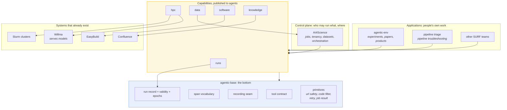

# The picture

## Reading it in one paragraph

The systems at the bottom right already exist and are not ours to rebuild. Each is published to
agents as one capability with a curated surface. Those capabilities all stand on the same
contracts, which is what this repository is. Applications sit on top and bring their own agent.

The only capability without an existing system behind it is **runs**, which is why the record
lives here and the rest do not.

## What "moving things" would actually mean

Nothing moves into this repository from AI4Science. Its job is the control plane and it keeps it.

What moves is narrower: pieces of agentic-env that are not experiment-specific, so that
agentic-env keeps its experiments and stops also being everyone's library. Roughly 3,300 lines,
in three groups.

| group | what | why here |
|---|---|---|
| primitives | job result, url safety, atomic write, container, slurm types | every consumer needs them and each writes them wrong differently |
| contracts | tool types, span vocabulary | a capability must have one name and one vocabulary or telemetry cannot be joined |
| protocol | the MCP layer, minus its chokepoint | publishing a capability is the same job every time |

## Three things must be true before any of it moves

1. **The repository exists on the server.** It does not yet. One merge request, waiting on the
   platform team.
2. **The consumer records which version of this layer it ran against.** Otherwise two runs share a
   configuration fingerprint, share a code revision, and have run different software. This is on
   the consumer's side, not ours.
3. **Relocation lands separately from behaviour change.** Moving a module that behaves identically
   changes nothing observable. Changing what a health probe asserts does. Bundled, neither can be
   attributed later.

Until then the work here is building the capability so the move is a deletion on the other side
rather than a migration.
