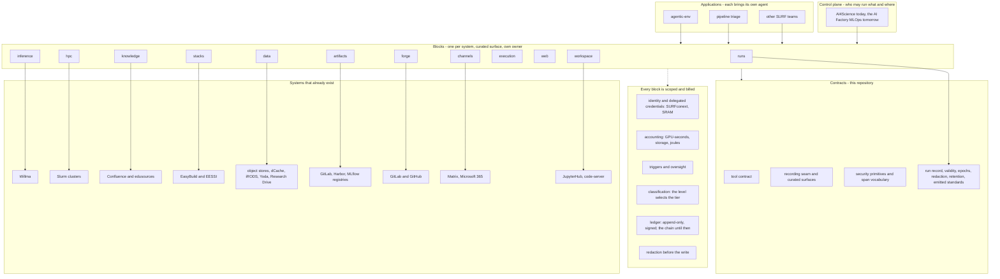

# The picture

Three ways to read the same diagram. The text one below needs nothing installed.
`picture.svg` next to this file opens in any browser or in VS Code directly.
The mermaid block at the bottom needs a mermaid-capable viewer.

## The stack, in text

```text
  APPLICATIONS            people's own work, each brings its own agent
  ┌──────────────────┬──────────────────────┬────────────────────┐
  │ agentic-env      │ pipeline triage      │ other SURF teams   │
  │ experiments      │ a new SURF project   │ and their agents   │
  └──────────────────┴──────────────────────┴────────────────────┘
                              │
  CONTROL PLANE               │   who may run what, and where
  ┌───────────────────────────▼────────────────────────────────┐
  │ AI4Science today; the AI Factory's MLOps and meta-scheduler │
  └───────────────────────────┬────────────────────────────────┘
                              │
  BLOCKS                      │   one per system, curated surface, own package, own owner
  ┌───────┬──────────┬──────────┬──────────┬──────┬──────────┬──────────┐
  │ runs  │ hpc      │inference │knowledge │ data │ stacks   │ artifacts│
  │ (here)│          │          │          │      │          │          │
  ├───────┼──────────┼──────────┼──────────┴──────┴──────────┴──────────┤
  │ forge │execution │ web      │ channels │ workspace   what an agent DOES │
  └───┬───┴────┬─────┴────┬─────┴────┬─────────┬────────┬───────────┬───┘
      │  scoped by IDENTITY and DELEGATED CREDENTIALS · billed by ACCOUNTING │
      │  started by TRIGGERS · gated by OVERSIGHT · tiered by CLASSIFICATION │
      │  redacted before the write · told it is an AI · recorded in a LEDGER │
      │                    │          │          │        │          │
  CONTRACTS   │  THIS REPOSITORY   │          │          │        │
  ┌───────────▼────────────▼──────────▼──────────▼────────▼──────────▼────┐
  │ tool contract │ recording seam │ curated surfaces │ security │ spans │
  ├────────────────────────────────────────────────────────────────────────┤
  │ run record · label provenance · validity · epochs                    │
  │ redaction · retention · PROV, OpenLineage, RO-Crate, MLflow          │
  └────────────────────────────────────────────────────────────────────────┘

  ALREADY EXIST, not ours to rebuild
  ┌──────────┬───────────────┬────────────┬───────────┬──────────────────┬──────────────┐
  │ Willma   │ Slurm         │ Confluence │ EasyBuild │ object stores,   │ registries   │
  │ serves   │ Snellius,LUMI │ edusources │ EESSI     │ dCache, iRODS,   │ GitLab,      │
  │ models   │ AI Factory    │            │           │ Yoda, Res. Drive │ Harbor,MLflow│
  └──────────┴───────────────┴────────────┴───────────┴──────────────────┴──────────────┘
   each is published as exactly one block above; see blocks.md
```

## Reading it in one paragraph

The systems at the bottom already exist and are not ours to rebuild. Each is published to agents as
one capability with a curated, read-only-by-default surface. Those capabilities all stand on the
same contracts, which is what this repository is. Applications sit on top and bring their own agent.

The only block with no existing system behind it is **runs**, which is why the record lives here
and the rest do not. The band between the blocks and the contracts is not a block an agent
calls. It is the capabilities every block is subject to: identity and delegated credentials
scope every surface, accounting bills every run, triggers start one, oversight can stop one,
classification picks the tier it runs on, redaction runs before the write, transparency tells the
person they are dealing with an AI, and a ledger keeps the result. Each has a field on the record now and most have no implementation yet; they are
named because a design that leaves them implicit gets them wrong. The full list, with what
exists behind each block and the order to build them, is in `blocks.md`.

## What has moved, and what has to be true for the rest

Nothing moves into this repository from the control plane. Its job is the control plane and it
keeps it. What moved is the part of agentic-env that is not experiment-specific, so agentic-env
keeps its experiments and stops being everyone's library.

| group | what | where it is |
|---|---|---|
| primitives | job result, url safety, completion probe, limits mechanism, code pre-filter | here; agentic-env imports the job result |
| contracts | tool types, span vocabulary, recording seam, curated surfaces | here; agentic-env reads the vocabulary from here and a test there refuses a copy |
| record and emitters | run record, validity, epochs, PROV, OpenLineage, RO-Crate, MLflow | here; agentic-env extends these documents through the standards' libraries instead of building its own |
| protocol | the MCP surface on the official SDK | here; agentic-env serves over the same SDK and deleted its two hand-rolled servers |

Two conditions hold for every move.

1. **The consumer records which version of this layer it ran against.** Otherwise two runs share
   a configuration fingerprint and a code revision and have run different software. agentic-env
   does this: the installed version is written beside every rung fingerprint and into the
   environment snapshot, and its ledger reader refuses to pool across an undeclared version.
2. **Relocation and behaviour change land separately.** Moving a module that behaves identically
   changes nothing observable. Changing what a probe asserts does. Bundled, neither can be
   attributed afterwards.

## The same thing as mermaid


