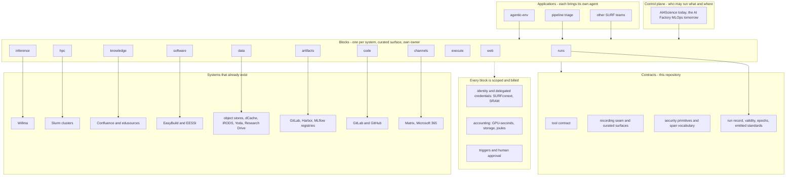

# The picture

Three ways to read the same diagram. The text one below needs nothing installed.
`picture.svg` next to this file opens in any browser or in VS Code directly.
The mermaid block at the bottom needs a mermaid-capable viewer.

## The stack, in text

```text
  APPLICATIONS            people's own work, each brings its own agent
  ┌──────────────────┬──────────────────────┬────────────────────┐
  │ agentic-env      │ pipeline triage      │ other SURF teams   │
  │ experiments      │ a new SURF project   │ and their agents   │
  └──────────────────┴──────────────────────┴────────────────────┘
                              │
  CONTROL PLANE               │   who may run what, and where
  ┌───────────────────────────▼────────────────────────────────┐
  │ AI4Science today; the AI Factory's MLOps and meta-scheduler │
  └───────────────────────────┬────────────────────────────────┘
                              │
  BLOCKS                      │   one per system, curated surface, own package, own owner
  ┌───────┬──────────┬──────────┬──────────┬──────┬──────────┬──────────┐
  │ runs  │ hpc      │inference │knowledge │ data │ software │ artifacts│
  │ (here)│          │          │          │      │          │          │
  ├───────┼──────────┼──────────┼──────────┴──────┴──────────┴──────────┤
  │ code  │ execute  │ web      │ channels     what an agent DOES        │
  └───┬───┴────┬─────┴────┬─────┴────┬─────────┬────────┬───────────┬───┘
      │  scoped by IDENTITY and DELEGATED CREDENTIALS · billed by ACCOUNTING │
      │  started by TRIGGERS · gated by HUMAN APPROVAL                       │
      │                    │          │          │        │          │
  CONTRACTS   │  THIS REPOSITORY   │          │          │        │
  ┌───────────▼────────────▼──────────▼──────────▼────────▼──────────▼────┐
  │ tool contract │ recording seam │ curated surfaces │ security │ spans │
  ├────────────────────────────────────────────────────────────────────────┤
  │ run record · label provenance · validity · epochs · emitted standards │
  └────────────────────────────────────────────────────────────────────────┘

  ALREADY EXIST, not ours to rebuild
  ┌──────────┬───────────────┬────────────┬───────────┬──────────────────┬──────────────┐
  │ Willma   │ Slurm         │ Confluence │ EasyBuild │ object stores,   │ registries   │
  │ serves   │ Snellius,LUMI │ edusources │ EESSI     │ dCache, iRODS,   │ GitLab,      │
  │ models   │ AI Factory    │            │           │ Yoda, Res. Drive │ Harbor,MLflow│
  └──────────┴───────────────┴────────────┴───────────┴──────────────────┴──────────────┘
   each is published as exactly one block above; see blocks.md
```

## Reading it in one paragraph

The systems at the bottom already exist and are not ours to rebuild. Each is published to agents as
one capability with a curated, read-only-by-default surface. Those capabilities all stand on the
same contracts, which is what this repository is. Applications sit on top and bring their own agent.

The only block with no existing system behind it is **runs**, which is why the record lives here
and the rest do not. Two things on the picture are not blocks an agent calls: identity scopes
every surface and accounting bills every run, and both are named because a design that leaves
them implicit gets them wrong. The full list, with what exists behind each block and the order
to build them, is in `blocks.md`.

## What "moving things" would actually mean

Nothing moves into this repository from AI4Science. Its job is the control plane and it keeps it.

What moves is narrower: pieces of agentic-env that are not experiment-specific, so that
agentic-env keeps its experiments and stops also being everyone's library. Roughly 3,300 lines,
in three groups.

| group | what | why here |
|---|---|---|
| primitives | job result, url safety, atomic write, container, slurm types | every consumer needs them and each writes them wrong differently |
| contracts | tool types, span vocabulary | a capability must have one name and one vocabulary or telemetry cannot be joined |
| protocol | the MCP layer, minus its chokepoint | publishing a capability is the same job every time |

## Three things must be true before any of it moves

1. **The repository exists on the server.** It does not yet. One merge request, waiting on the
   platform team.
2. **The consumer records which version of this layer it ran against.** Otherwise two runs share a
   configuration fingerprint, share a code revision, and have run different software. This is on
   the consumer's side, not ours.
3. **Relocation lands separately from behaviour change.** Moving a module that behaves identically
   changes nothing observable. Changing what a health probe asserts does. Bundled, neither can be
   attributed later.

Until then the work here is building the capability so the move is a deletion on the other side
rather than a migration.

## The same thing as mermaid


